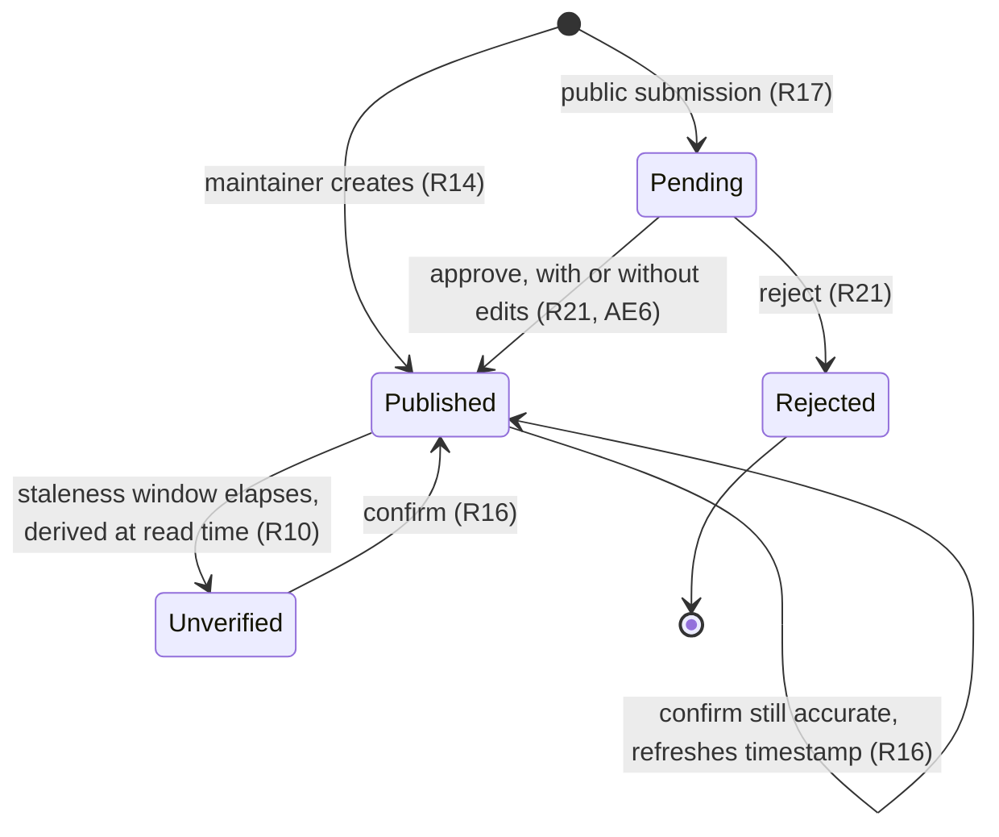
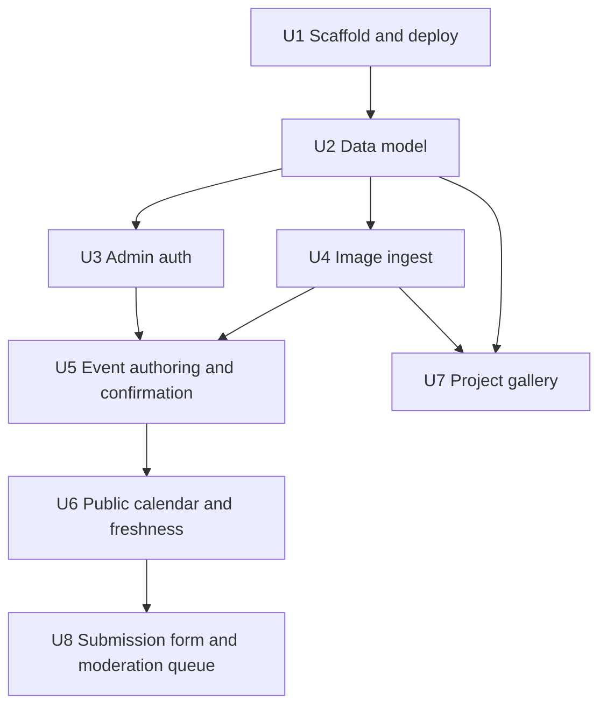

# feat: Community center calendar, gallery, and submission queue

## Summary

Next.js App Router on Vercel with Postgres and Better Auth, where public pages render statically and revalidate on publish, staleness is computed at read time rather than by any scheduled job, and moderation is a state transition on the event itself rather than a parallel submissions system — so the build carries no background workers, no email dependency, and no second edit path.

---

## Problem Frame

The center's schedule lives only on a physical bulletin board, which makes it unreachable to anyone not already connected to the center. See the origin document for the full problem narrative.

Two plan-time realities shape the build. First, this is a solo volunteer project with a bus factor of one — the architecture has to survive months of neglect without degrading into misinformation, and every piece of infrastructure that needs tending is a liability. Second, the target is Vercel's Hobby tier, which **pauses the project** when storage, transfer, or image-transformation ceilings are tripped. A photo-bearing site that can take itself offline by being used is a live risk, not a theoretical one, so upload constraints are load-bearing rather than polish.

---

## Requirements

- R1. Fully public reading experience — no visitor accounts, logins, signups, or RSVPs.
- R2. Landing view shows upcoming events chronologically with no navigation required.
- R3. Each event shows name, date/time, location within the center, short description, and who runs it when known.
- R4. Calendar represents one-off events and recurring programs without re-entering weekly programs.
- R5. Gallery presents active and past projects with photos, description, and active/past status; projects and their upcoming events cross-link.
- R5a. Gallery photos show spaces, structures, and work products — no identifiable individuals in v1.
- R6. A forward calendar view beyond the current week.
- R7. Phone is the primary form factor for reading and posting.
- R8. Center address and hours are displayed.
- R9. Every event shows a visitor-visible last-confirmed date.
- R10. Events past the staleness window are presented as unverified, not as current.
- R11. When nothing has been confirmed within the staleness window, a site-level notice points to the bulletin board and city page.
- R12. The site states it is neighbor-maintained, is not the official site, links to the city/parks page, and names the bulletin board as authoritative.
- R13. A single authenticated admin account is the only way to publish; no self-registration.
- R14. Creating an event requires only a name and date/time; all other fields optional.
- R15. A flyer photo can be attached and can stand in for a written description.
- R16. Confirming an event is a single action that refreshes its confirmation date without opening an edit form; multiple events confirmable in one pass.
- R17. Anyone can submit an event through a public form without an account.
- R18. Submissions are never publicly visible until approved.
- R19. Submission form requires minimal fields, accepts a flyer photo, and treats submitter contact as optional.
- R20. The public form resists spam without requiring accounts.
- R21. The maintainer can approve, edit-then-approve, or reject each pending submission.
- R22. Content is exportable and not bound to the maintainer's personal identity.
- R23. v1 ships one publisher; the design must not preclude adding more later.

**Origin actors:** A1 (newcomer resident), A2 (maintainer), A3 (contributor — program director / community watch), A4 (future owner)
**Origin flows:** F1 (newcomer finds what's happening), F2 (maintainer transcribes the board), F3 (contributor submits without an account), F4 (information goes stale)
**Origin acceptance examples:** AE1 (R9, R10), AE2 (R11), AE3 (R17, R18), AE4 (R14, R15), AE5 (R16), AE6 (R21)

---

## Scope Boundaries

### Deferred for later

*Carried from origin.*

- Payments and donations of any kind, including the community garden — gated on the garden having a bank account and an accountable person.
- Membership: member accounts, dues, rosters, renewals.
- Additional publisher accounts, roles, and permissions — gated on a program director asking.
- Email newsletters, notifications, and subscription blasts.
- Visitor-facing accounts, RSVPs, and attendance tracking.

### Outside this product's identity

*Carried from origin.*

- Program registration and facility/room booking — the city owns those flows and the money behind them.
- Being or appearing to be the center's official website.
- Replacing the physical bulletin board.
- A social layer — comments, profiles, messaging between neighbors.

### Deferred to Follow-Up Work

- Email of any kind, including submitter acknowledgments and magic-link auth. Removes a deliverability failure mode from a site nobody monitors.
- Search, tagging, and filtering beyond chronological ordering.
- Internationalization and analytics.
- Tests executed against a live deployed environment; test scope here is local unit, integration, and browser-driven.
- Automated backup/export tooling. R22 is satisfied in v1 by owning the database and storage accounts directly with no proprietary lock-in; scheduled export jobs are a later concern.

---

## Context & Research

### Relevant Code and Patterns

None. The repository contains only `README.md` — no `package.json`, no framework, no existing conventions, no `docs/solutions/`. Every pattern in this plan is introduced new, so U1 and U2 are establishing conventions rather than following them. The implementer should treat the first units as pattern-setting and keep them boring.

### External References

- Vercel Hobby tier: 1 GB Blob storage, 10 GB/month Blob data transfer, 5,000 image transformations/month; **exceeding a limit pauses the project**. This drives the upload constraints in U4 and the static-rendering decision in U6.
- Auth.js entered maintenance mode in early 2026 (security fixes only); Better Auth is the actively developed path for new Next.js projects. This drives the auth choice in U3.

---

## Key Technical Decisions

- **Staleness computed at read time, not by a scheduled job**: Each event carries a last-confirmed timestamp; unverified status and the site-level notice are derived when a page renders. This removes cron, queues, and background workers from the architecture entirely — the single largest reduction in things that can silently break on an unattended site.
- **Moderation is a state on the event, not a separate submissions table**: A submitted event and a published event are the same entity in different states, so approving is a transition. The maintainer's edit form and the moderation edit path are one code path and cannot drift apart. It also makes AE6 (edit-then-approve) fall out for free.
- **Images resized, dimension-capped, and EXIF-stripped at ingest**: Protects the free-tier ceiling that would otherwise pause the site, and strips GPS coordinates that phone photos of flyers and garden beds routinely carry. Both reasons are independently sufficient.
- **Public pages statically rendered, revalidated on publish**: Read traffic is the dominant load and none of it needs to be dynamic. Keeps function invocations and image transformations well below the Hobby ceilings, and makes the site fast on a phone with poor reception.
- **Recurring programs stored as a series plus per-occurrence exceptions**: Cancelling or moving one week must not disturb the series (R4). Materializing rows per occurrence would make edits ambiguous and inflate the table for no benefit at this volume.
- **Better Auth with a real users table seeded to one row**: Satisfies R13 now and R23 later — adding a publisher becomes inserting a row rather than replacing the auth layer. Chosen over env-var-password because rolling session handling by hand on a public site is the wrong place for a volunteer project to save a dependency.
- **Drizzle for schema and migrations**: Lightweight, SQL-transparent, and serverless-friendly; keeps the schema readable by whoever inherits this. Better Auth supports it directly.
- **No email dependency anywhere**: No notifications, no magic links, no submitter acknowledgments. An unattended site with a broken mail provider is a support burden with no owner.

---

## Open Questions

### Resolved During Planning

- Auth approach: Better Auth with a single seeded admin, no public registration route.
- Stack: Next.js App Router + TypeScript, Postgres, Vercel.
- Do we need background jobs for staleness? No — read-time derivation covers R10 and R11.
- Does moderation need its own storage? No — state transition on the event entity.

### Deferred to Implementation

- The exact staleness window value (R9–R11). It depends on how often the maintainer realistically visits the board; the window must be a single named constant so it can be tuned after a month of real use rather than guessed at now.
- Precise image dimension and byte caps. Set them from the actual Hobby ceilings and expected posting volume once the upload path exists and real flyer photos can be measured.
- Whether the forward calendar view (R6) is a distinct route or an extension of the landing list. Decide once the landing list exists and the volume of events is visible.
- Rate-limit thresholds for the public submission form. Tune against observed traffic; start conservative.

---

## Output Structure

    app/
      (public)/
        page.tsx                  # landing — upcoming events (R2)
        calendar/page.tsx         # forward calendar view (R6)
        events/[id]/page.tsx      # event detail (R3, R9, R10)
        projects/page.tsx         # gallery index (R5)
        projects/[slug]/page.tsx  # project detail (R5)
        submit/page.tsx           # public submission form (R17, R19)
      admin/
        page.tsx                  # confirmation pass + queue overview (R16)
        events/                   # authoring surfaces (R14, R15)
        queue/                    # pending submissions (R21)
      layout.tsx                  # site chrome, disclaimer, staleness notice (R11, R12)
    lib/
      db/schema.ts                # entities and constraints
      db/index.ts                 # connection
      auth.ts                     # Better Auth config, single seeded admin
      freshness.ts                # read-time staleness derivation (R9-R11)
      images.ts                   # resize, cap, EXIF strip, upload (R15)
      events/recurrence.ts        # series + exception expansion (R4)
      events/state.ts             # submitted -> published transitions (R18, R21)
    drizzle/                      # migrations
    tests/
    e2e/

---

## High-Level Technical Design

> *This illustrates the intended approach and is directional guidance for review, not implementation specification. The implementing agent should treat it as context, not code to reproduce.*

Content lifecycle. Every event — whether typed by the maintainer or submitted by a neighbor — moves through the same states, which is what keeps moderation and authoring on one code path:

`Unverified` is not a stored state. It is computed from the last-confirmed timestamp whenever a page renders, which is why no scheduled job exists in this architecture.

---

## Implementation Units

- U1. **Project scaffold and deployment skeleton**

**Goal:** A Next.js App Router project on TypeScript, connected to Postgres, deploying to Vercel, with migration tooling and a test runner wired up.

**Requirements:** Enables all; satisfies none directly.

**Dependencies:** None

**Files:**
- Create: `package.json`, `tsconfig.json`, `next.config.ts`, `app/layout.tsx`, `app/page.tsx`
- Create: `lib/db/index.ts`, `drizzle.config.ts`
- Create: `vitest.config.ts`, `playwright.config.ts`
- Create: `.env.example`, `README.md` (replace placeholder)

**Approach:**
- Establish conventions deliberately — this repo has none, and everything after this unit inherits whatever is chosen here.
- Postgres via a managed provider attached to the Vercel project; connection through a pooled URL suitable for serverless.
- `.env.example` documents every variable so the future owner (A4) can stand this up without archaeology.

**Patterns to follow:** None exist. Prefer framework defaults over custom structure.

**Test scenarios:**
- Test expectation: none — scaffolding with no behavioral change. Verification is a successful build and deploy.

**Verification:**
- A placeholder page builds locally and renders on a Vercel deployment.
- Migration tooling connects to Postgres and can apply an empty migration.

---

- U2. **Data model and migrations**

**Goal:** Schema for users, events (including recurrence series and exceptions), projects, and images, with the constraints that make invalid states unrepresentable.

**Requirements:** R4, R9, R18, R22, R23

**Dependencies:** U1

**Files:**
- Create: `lib/db/schema.ts`
- Create: `drizzle/` migration files
- Test: `tests/schema.test.ts`

**Approach:**
- Events carry publication state (pending / published / rejected) and a last-confirmed timestamp. State and timestamp are the two fields the entire freshness and moderation design rests on.
- Recurrence stored as a series definition plus an exception set; occurrences are expanded at read time, never materialized.
- Users table is real and carries a role field even though exactly one row is seeded — this is what makes R23 a data change later instead of a rewrite.
- Projects carry active/past status and link to events (R5).
- No proprietary column types or vendor-specific features, so the database stays portable for R22.

**Test scenarios:**
- Happy path: a published event with a last-confirmed timestamp round-trips through insert and read.
- Edge case: a recurring series with one cancelled occurrence stores the exception without altering the series definition.
- Error path: an event row with an invalid publication state is rejected by a constraint, not silently stored.
- Error path: a project cannot be marked both active and past.

**Verification:**
- Migrations apply cleanly from empty and are reversible.
- Constraints reject the invalid-state cases above rather than accepting them.

---

- U3. **Admin authentication**

**Goal:** Better Auth configured with a single seeded admin, no public registration, and an enforced gate on every write path.

**Requirements:** R13, R23

**Dependencies:** U2

**Files:**
- Create: `lib/auth.ts`
- Create: `app/admin/login/page.tsx`
- Create: `scripts/seed-admin.ts`
- Modify: `app/layout.tsx`
- Test: `tests/auth-gate.test.ts`

**Approach:**
- Email + password against the users table from U2. No OAuth providers, no registration route, no password-reset flow — each would be an unused surface with a maintenance cost.
- The admin user is created by an explicit seeding script run once, never by a public route.
- The write-path gate is centralized so that adding a new mutation cannot accidentally ship unauthenticated. This is the security-critical seam of the project: every subsequent unit adds write paths behind it.

**Execution note:** Write the auth-gate tests first. This is the one place where a silent failure is a public compromise rather than a cosmetic bug, and the tests are cheaper to write before the surfaces exist than to retrofit across five units.

**Test scenarios:**
- Happy path: the seeded admin signs in and receives a valid session.
- Error path: a request to any write path without a session is rejected.
- Error path: a request with an expired or tampered session is rejected.
- Error path: no route exists that allows creating a user from the public internet.
- Edge case: signing out invalidates the session for subsequent write attempts.
- Integration: an authenticated session established in the browser persists across a server-rendered navigation.

**Verification:**
- Every mutation in the app is unreachable without a valid session.
- The only path to an admin account is the seeding script.

---

- U4. **Image ingest pipeline**

**Goal:** Uploaded photos are resized, dimension-capped, size-capped, and EXIF-stripped before reaching storage.

**Requirements:** R15, R5a (supports), R7

**Dependencies:** U2

**Files:**
- Create: `lib/images.ts`
- Create: `app/api/upload/route.ts`
- Test: `tests/images.test.ts`

**Approach:**
- Every image passes through one ingest function — there is no path to storage that bypasses it. This is what makes the free-tier protection actually hold rather than depend on the caller remembering.
- Downscale to a maximum dimension and re-encode; reject payloads over a byte cap before processing rather than after.
- Strip all EXIF metadata. Phone photos of flyers and garden beds carry GPS coordinates, and this site publishes them.
- Serve through the framework's image optimization with fixed size variants, keeping monthly transformations bounded rather than growing with the number of distinct rendered sizes.

**Patterns to follow:** None exist; this unit sets the upload convention for U5, U7, and U8.

**Test scenarios:**
- Happy path: a large JPEG is downscaled to within the dimension cap and stored.
- Happy path: EXIF metadata including GPS is absent from the stored output.
- Edge case: an image already under the cap is re-encoded but not upscaled.
- Edge case: a portrait phone photo retains its orientation after metadata stripping.
- Error path: a payload over the byte cap is rejected before processing begins.
- Error path: a non-image file, and a file with an image extension but non-image content, are both rejected.
- Integration: an upload initiated from the browser lands in storage in processed form, not original form.

**Verification:**
- No code path writes an unprocessed image to storage.
- Stored outputs carry no EXIF and respect both caps.

---

- U5. **Event authoring and the confirmation pass**

**Goal:** The maintainer can create, edit, and publish an event from a phone in seconds, and can confirm that existing events are still accurate without opening edit forms.

**Requirements:** R14, R15, R16, R7; F2; AE4, AE5

**Dependencies:** U3, U4

**Files:**
- Create: `app/admin/page.tsx`, `app/admin/events/new/page.tsx`, `app/admin/events/[id]/edit/page.tsx`
- Create: `lib/events/state.ts`, `lib/events/recurrence.ts`
- Test: `tests/events-authoring.test.ts`, `tests/recurrence.test.ts`
- Test: `e2e/publish-flow.spec.ts`

**Approach:**
- Only name and date/time are required (R14). Every additional required field is a reason the maintainer doesn't post while standing at the board.
- A flyer photo can carry the event on its own, with no typed description (R15).
- The confirmation pass is a list with a one-tap confirm per event and a way to confirm several in one session (R16) — it updates the timestamp only and never opens an edit form. This is the mechanic the entire freshness design depends on, so it has to be faster than editing, not merely available.
- Publishing triggers revalidation of the affected public pages.
- Series expansion and per-occurrence exceptions live in one module so that authoring, public rendering, and moderation all read recurrence the same way.

**Test scenarios:**
- Happy path: `Covers AE4.` An event created with only a name and date/time, plus an attached flyer photo and no description, publishes successfully.
- Happy path: `Covers AE5.` Six accurate events confirmed in one pass all have refreshed confirmation timestamps and no modified fields.
- Happy path: a recurring weekly program entered once appears on each future occurrence.
- Edge case: cancelling a single occurrence of a series leaves the remaining occurrences intact.
- Edge case: moving a single occurrence to a different time does not shift the series.
- Edge case: an event created with a past date is handled deliberately rather than silently vanishing from every view.
- Error path: submitting without a name or without a date/time is rejected with the field identified.
- Error path: an unauthenticated request to any authoring or confirmation action is rejected.
- Integration: publishing an event revalidates the public pages that display it.

**Verification:**
- An event can be posted end-to-end from a phone-sized viewport with two required inputs.
- Confirming events changes only their timestamps.

---

- U6. **Public calendar, freshness, and site identity**

**Goal:** The public reading experience — upcoming events, event detail, forward calendar — with read-time staleness derivation, the site-level stale notice, and the neighbor-maintained disclaimer.

**Requirements:** R1, R2, R3, R6, R7, R8, R9, R10, R11, R12; F1, F4; AE1, AE2

**Dependencies:** U5

**Files:**
- Create: `app/(public)/page.tsx`, `app/(public)/calendar/page.tsx`, `app/(public)/events/[id]/page.tsx`
- Create: `lib/freshness.ts`
- Modify: `app/layout.tsx`
- Test: `tests/freshness.test.ts`, `tests/public-pages.test.ts`

**Approach:**
- The landing page answers "what's happening soon" with no navigation and no interaction (R2). Everything else is secondary to that view rendering fast on a phone.
- Staleness is derived in one module from the last-confirmed timestamp against a single named window constant. Both the per-event unverified marking (R10) and the site-level notice (R11) read from it, so they can never disagree.
- The unverified presentation still shows the event. Hiding stale events would be a different and worse failure — a newcomer seeing nothing concludes the center is dead, where a newcomer seeing "last confirmed five weeks ago" knows exactly what they're looking at.
- Pages render statically and revalidate on publish and on confirmation, keeping read traffic off the function budget.
- The disclaimer, city/parks link, address, and hours live in the shared layout so no page can omit them (R8, R12).

**Test scenarios:**
- Happy path: `Covers F1 / AE1.` An event confirmed within the window renders as current with its confirmation date visible.
- Happy path: upcoming events render in chronological order on the landing view.
- Edge case: `Covers AE1.` An event last confirmed beyond the window renders as unverified, still visible, with its confirmation date shown.
- Edge case: `Covers AE2.` When nothing on the site has been confirmed within the window, the site-level notice appears on every public page.
- Edge case: an event exactly at the staleness boundary resolves deterministically rather than flickering between states.
- Edge case: with no events at all, the landing view says so rather than rendering an empty region.
- Edge case: a recurring series renders its next occurrence, not its series definition.
- Error path: no public page exposes an authoring or confirmation control, signed in or not.
- Integration: confirming an event in admin causes the public page to reflect the new confirmation date after revalidation.

**Verification:**
- Per-event and site-level staleness derive from the same window constant.
- The disclaimer and city/parks link are present on every public page.

---

- U7. **Project gallery**

**Goal:** Active and past projects with photos and descriptions, cross-linked with their upcoming events.

**Requirements:** R5, R5a, R7

**Dependencies:** U2, U4

**Files:**
- Create: `app/(public)/projects/page.tsx`, `app/(public)/projects/[slug]/page.tsx`
- Create: `app/admin/projects/` authoring surfaces
- Test: `tests/projects.test.ts`

**Approach:**
- Active and past are visually distinct, not merely a sort order — a newcomer's question is "is this place alive right now," and the answer has to be legible at a glance (F1).
- Where a project has upcoming events, the project page lists them and those events link back (R5).
- Photos go through the U4 ingest path with no exceptions.
- R5a is a content policy, not something code can enforce. The authoring surface should carry a visible reminder rather than pretending a technical control exists.

**Test scenarios:**
- Happy path: a project with photos and a description renders with its active/past status.
- Happy path: a project with upcoming events lists them, and those events link back to the project.
- Edge case: a project with no photos renders without a broken image region.
- Edge case: a past project with no upcoming events renders without an empty events section.
- Error path: unauthenticated requests to project authoring are rejected.
- Integration: a photo added to a project passes through the ingest pipeline rather than reaching storage directly.

**Verification:**
- Active and past projects are distinguishable without reading text.
- No gallery upload path bypasses U4.

---

- U8. **Public submission form and moderation queue**

**Goal:** Anyone can submit an event without an account; nothing they submit is public until the maintainer approves it.

**Requirements:** R17, R18, R19, R20, R21; F3; AE3, AE6

**Dependencies:** U6

**Files:**
- Create: `app/(public)/submit/page.tsx`
- Create: `app/admin/queue/page.tsx`
- Modify: `lib/events/state.ts`
- Test: `tests/submissions.test.ts`
- Test: `e2e/submission-flow.spec.ts`

**Approach:**
- A submission creates an event in pending state — the same entity U5 authors, in a different state. Approving is a transition, and editing before approving reuses the U5 edit surface (AE6).
- The form asks for as little as possible and accepts a flyer photo in place of typed detail (R19). Contact info is optional; a contributor who won't leave their number should still be able to contribute.
- Spam resistance is a honeypot field, rate limiting by origin, and payload caps (R20). No CAPTCHA — it is a barrier for exactly the older and less technical neighbors most likely to be running programs.
- Submitted photos pass through U4 ingest before storage, so an untrusted upload path cannot bypass the caps that protect the deployment.
- Rejection is terminal and reversible only by resubmission; there is no notification to the submitter, by design.

**Test scenarios:**
- Happy path: `Covers AE3 / F3.` A submitted event is absent from all public views immediately after submission and present in the maintainer's queue.
- Happy path: `Covers AE6.` A submission with a wrong start time, corrected in the queue and approved, publishes in corrected form; the original is never public.
- Happy path: an approved submission appears publicly with a confirmation timestamp set at approval.
- Edge case: a submission with only a name, date, and flyer photo is accepted.
- Edge case: a rejected submission never becomes publicly visible by any route.
- Edge case: an empty queue renders as such rather than as a broken view.
- Error path: a filled honeypot field is discarded without creating an event.
- Error path: submissions exceeding the rate limit are refused without exposing whether earlier ones succeeded.
- Error path: an oversized or non-image attachment is rejected by the U4 ingest path.
- Error path: unauthenticated requests to approve or reject are rejected.
- Integration: an untrusted submitted photo is processed and EXIF-stripped identically to a maintainer upload.

**Verification:**
- No pending or rejected event is reachable from any public route.
- Approving and editing use the same code path as maintainer authoring.

---

## System-Wide Impact

- **Interaction graph:** The auth gate (U3), the image ingest path (U4), and the event state module (U5) are each touched by multiple later units. A change to any of the three affects authoring, gallery, and submissions simultaneously.
- **Error propagation:** Upload failures must surface to the poster rather than silently producing an event with a missing image — a maintainer standing at the bulletin board needs to know immediately whether the post worked.
- **State lifecycle risks:** A published event whose image upload failed, and a pending event approved twice, are the two partial-state cases to guard. Both are avoided by treating the event row as the single source of state.
- **API surface parity:** Both the maintainer upload path and the public submission upload path must enforce identical constraints. Divergence here turns the public form into a way to bypass the caps that keep the deployment alive.
- **Integration coverage:** Publish-then-revalidate and submit-then-approve cross layers and will not be proven by unit tests alone; both need integration or browser-level coverage.
- **Unchanged invariants:** No public route ever mutates state. The public surface is read-only except for the single submission endpoint, which can only create pending records and can never produce published content.

---

## Success Metrics

*Carried from the origin document — these are how we know the build solved the right problem, not whether it shipped.*

- The maintainer stops walking to the building to check what's on.
- A neighbor who is not the maintainer discovers the site and attends something they learned about there.
- Three months after launch the calendar is either still accurate, or the site is visibly telling visitors it isn't — the freshness mechanic (U6) is what makes the second outcome acceptable rather than a failure.
- At least one program director or the community watch sends a schedule or uses the submission form (U8). Without this signal, v1 remains the whole product and the deferred multi-publisher work stays deferred.

---

## Dependencies / Prerequisites

- The maintainer has regular physical access to the bulletin board. All content originates there; the system has no other input.
- Content volume is low — a handful of events per week. The static-rendering and no-background-jobs decisions assume this and would need revisiting at an order of magnitude more.
- **Unverified:** the center is assumed to be a city or parks-department facility. This assumption is what places program registration and fees outside scope, and it drives the disclaimer in U6.
- **Unverified:** the community garden is assumed volunteer-run rather than a city program. Affects the deferred payments work only.
- Vercel, Postgres, and blob storage accounts are owned outright by the maintainer with no proprietary lock-in, which is how R22 is satisfied in v1.
- Public launch is gated on the two `Resolve Before Launch` items in the origin document. These block going public, not building.

---

## Risks & Dependencies

| Risk | Mitigation |
|------|------------|
| Vercel Hobby limits trip and pause the site | Static rendering keeps functions and transformations low; U4 caps storage and transfer growth at ingest; fixed image size variants bound transformation count |
| The maintainer stops updating and the calendar misinforms | Read-time staleness (U6) degrades the site into an honest one; the site-level notice fires without anyone needing to act |
| Public submission form is abused | Honeypot, rate limiting, payload caps, and mandatory ingest processing (U8); nothing submitted reaches the public without approval |
| Photos publish location data or identifiable people | EXIF stripped at ingest (U4); R5a content policy surfaced in the authoring UI (U7) |
| Bus factor of one — the maintainer moves or loses interest | R22 portability: no proprietary storage, owned accounts, standard Postgres; U8 lowers the barrier for a second contributor to exist at all |
| The center or city objects to the site after launch | Disclaimer and official-page link ship in the shared layout (U6); the two launch-gate questions in the origin document are resolved before going public |

---

## Documentation / Operational Notes

- `.env.example` and the README must let A4 (a future owner) stand the project up without contacting the original maintainer — this is R22 in practice.
- The staleness window and image caps should be named constants in one place, documented as tunable, since both are explicitly deferred to post-launch observation.
- Before public launch, the two `Resolve Before Launch` items in the origin document must be settled: someone at the center knowing the site exists, and the city's stance on facility-name use.

---

## Sources & References

- **Origin document:** [docs/brainstorms/2026-08-15-community-center-website-requirements.md](docs/brainstorms/2026-08-15-community-center-website-requirements.md)
- Vercel Hobby tier limits (Blob storage, transfer, image transformations, project pausing): [Vercel free tier limits in 2026](https://www.promptstoproduct.com/vercel-free-tier-limits), [Vercel Free Tier Guide](https://infrafree.dev/en-us/provider/vercel)
- Auth.js maintenance status and Better Auth as the active path: [Next.js Auth in 2026: Clerk vs Better Auth vs Auth.js v5](https://blog.codercops.com/blog/nextjs-auth-comparison-clerk-better-auth-2026), [Top authentication solutions for Next.js in 2026](https://workos.com/blog/top-authentication-solutions-nextjs-2026)
