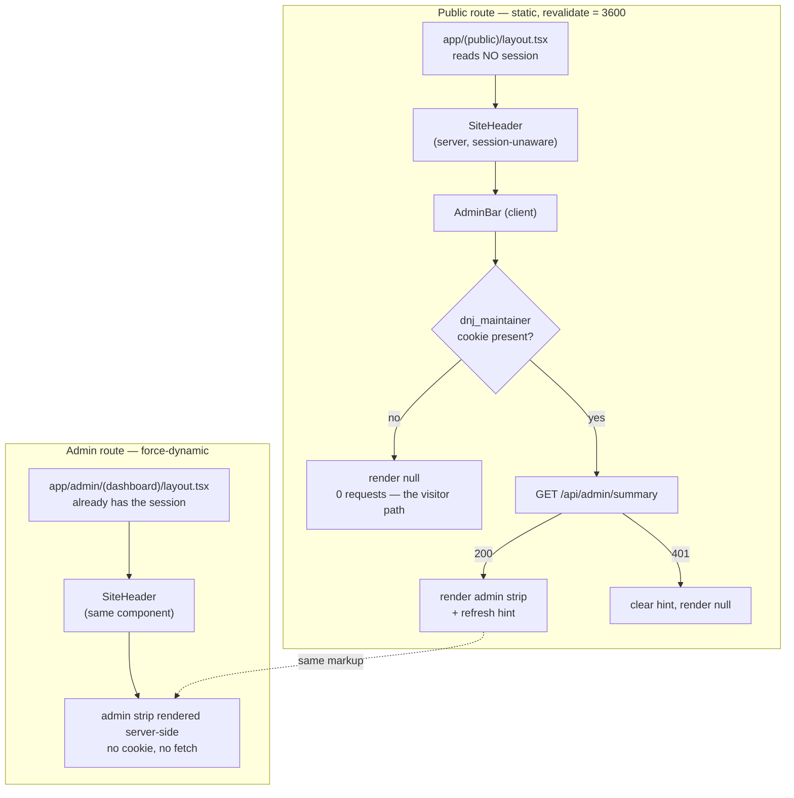

# feat: Give the maintainer one header and in-place editing on public pages

## Summary

Replace the two divergent headers with a single shared, properly designed one, and let a signed-in maintainer edit and confirm content from the public pages they are already looking at. The admin chrome is rendered entirely client-side and gated on a non-secret hint cookie, so public pages keep their `revalidate = 3600` static rendering and a signed-out visitor pays no extra network request and sees byte-identical HTML.

---

## Problem Frame

Two problems, one header.

**The maintainer has to context-switch to do anything.** Editing an event means leaving the page that shows it, going to `/admin`, finding the same event in a list, and clicking through to its edit form. The same is true for projects. Confirming an event against the bulletin board — the single most frequent maintenance action on this site (R16) — is only possible from the dashboard, even though the maintainer is often looking at the public page the confirmation affects.

**The header is two headers, and neither is designed.** `app/(public)/layout.tsx` renders five links, all underlined, in a wrapped row under the site name — visually undifferentiated, no indication of which page you are on, and a wrap that exists to stop an overflow rather than because it reads well. `app/admin/(dashboard)/layout.tsx` renders a completely separate nav with a different container width, different link set, and no way back to the public pages except a "View site" link. They have already drifted and will keep drifting.

**The constraint that makes this non-trivial.** `app/(public)/layout.tsx` deliberately reads no session, and carries a comment saying so. That absence is what keeps every public page statically rendered, which the prior plan (`docs/plans/2026-08-18-001-feat-admin-sign-in-entry-point-plan.md`) records as load-bearing for the Vercel Hobby function budget — a budget the origin document treats as a live project risk, because tripping it pauses the site. Admin buttons on public pages collide with that head-on. Resolving the collision, rather than paying for it with dynamic rendering, is the substance of this plan.

---

## Requirements

- R1. A signed-out visitor's experience is unchanged — same HTML, same requests, no authoring or confirmation control reachable, nothing implying an account is needed. *(origin R1, R17)*
- R2. Public pages remain statically rendered with `revalidate = 3600`. No session read enters `app/(public)/layout.tsx` or any public page or `generateStaticParams` path. *(project constraint; see origin risk on Hobby ceilings)*
- R3. A signed-in maintainer sees the same site navigation in the header on every page, public and admin alike, plus admin actions appended and visibly marked as a different mode. *(origin R7)*
- R4. From a public event or project surface, a signed-in maintainer can reach that item's edit form in one tap. *(origin R14, R21)*
- R5. From a public event surface, a signed-in maintainer can confirm the event against the board in one tap without opening an edit form, and the public page reflects the new date. *(origin R16, R9)*
- R6. Contextual "add" shortcuts and a pending-submission count are available to the maintainer where they are relevant. *(origin R21)*
- R7. The header is visually coherent — clear hierarchy between site identity, navigation, the visitor action, and the maintainer door — and works at a 320px viewport without horizontal scroll. *(origin R7)*
- R8. The admin hint cookie is never an authorization signal. Every admin route and every mutation stays gated server-side by the existing `requireAdmin`. Forging the cookie grants nothing but the sight of links that redirect to a login page. *(origin R13)*
- R9. A visitor's page load issues zero additional network requests relative to today. Admin-only requests happen only when the hint cookie is present.

**Origin actors:** A2 (maintainer — the sole beneficiary of every new affordance), A1 (newcomer resident — must see no change at all)
**Origin flows:** F2 (maintainer transcribes and confirms against the board — this plan moves its most frequent step to where the maintainer already is)
**Origin acceptance examples:** R16's "confirming is faster than editing" property is the one this plan most directly extends, and most directly at risk of being broken by a careless inline-confirm implementation.

---

## Scope Boundaries

- No change to the authentication model, session handling, seeding, sign-up policy, or the `requireAdmin` write gate. R13's security properties are untouched — see R8.
- No roles or permissions system. There is still exactly one publisher (origin R23). "Admin role" in this plan means "the signed-in maintainer", not a role model.
- No inline *editing* on public pages — the affordances link to the existing admin forms. Only confirmation, which is already a one-action operation, happens in place.
- No delete, reject, approve, or publish controls on public surfaces. Destructive and moderation actions stay in the dashboard where the surrounding context is.
- No sticky header, no collapsing mobile menu, no hamburger. Considered and declined — see Key Technical Decisions.
- No dark mode, no palette change, no new colors. The existing tokens in `app/globals.css` are the whole vocabulary.
- No changes to `lib/events/state.ts`, `lib/projects/state.ts`, or any other write path. Every mutation this plan surfaces already exists and is already gated.

### Deferred to Follow-Up Work

- Inline cancel/move for a single occurrence of a recurring event (`cancelOccurrence`, `moveOccurrence` exist in `lib/events/state.ts` but have no UI on any surface yet). Out of scope here; it is its own design problem.
- Retiring the `/admin` dashboard's own "Edit an event" and "Past events" lists once in-place editing proves sufficient. Keep both for now — the dashboard list is still the only way to reach a past event.

---

## Context & Research

### Relevant Code and Patterns

- `app/(public)/layout.tsx` — the public shell. `export const revalidate = 3600`, header nav of five `next/link` items in a `flex flex-wrap gap-x-4 gap-y-2` row, all `underline` except the muted "Maintainer". Carries an explicit comment forbidding a session read here; that comment survives this plan intact and should be extended, not deleted.
- `app/admin/(dashboard)/layout.tsx` — `export const dynamic = "force-dynamic"`, reads the session with `getSession(await headers())` and redirects to `/admin/login` when absent. Container is `max-w-3xl` against the public shell's `max-w-2xl`. This layout *can* render admin chrome server-side, because it is already dynamic and already knows the session — U4 uses that.
- `app/admin/login/login-form.tsx` — client sign-in. Ends with `window.location.assign("/admin")` and a comment explaining why it is a full navigation rather than `router.push` (the cookie-commit race). The hint cookie must be written *before* that line.
- `app/admin/(dashboard)/sign-out-button.tsx` — client sign-out. The symmetric clear point.
- `lib/auth-client.ts` — `createAuthClient()` from `better-auth/react`, exporting `signIn`, `signOut`, `useSession`. `useSession` exists but is unused today; this plan deliberately does not adopt it on public pages (see Key Technical Decisions).
- `lib/auth-guard.ts` — `getSession` for rendering decisions, `requireAdmin` for writes, `UnauthorizedError`. The summary route in U3 uses `requireAdmin` and lets the error become a 401.
- `lib/events/state.ts:160` — `confirmEvents(ids)` calls `requireAdmin` first and already calls `revalidatePublicPages(...)` with each confirmed event's `/events/[id]` path. This is why inline confirm works end to end with no new revalidation logic.
- `lib/events/revalidate.ts` — `PUBLIC_EVENT_PATHS = ["/", "/calendar"]` plus per-item paths, skipped outside a Next runtime.
- `app/admin/actions.ts` — `"use server"` actions. The pattern to mirror: `await requireAdminAction()` up front, thin body, state module does the real gate. `confirmEventsAction` takes `FormData` with repeated `eventId` entries and revalidates `/admin`.
- `app/admin/form-helpers.ts` — `requireAdminAction`, `toActionState`, `ActionState`. Reuse rather than reinvent.
- `app/admin/(dashboard)/queue/page.tsx` — the pending-submission surface the queue count in U3/U4 links to.
- `app/form-ui.tsx` — `SubmitButton` with pending/label states, used by `ConfirmationPass`. The inline confirm button should feel like a sibling of this.
- `app/(public)/event-card.tsx` — shared by `/` and `/calendar`. One insertion point covers both.
- `app/(public)/projects/page.tsx` — `ProjectCard` is a local function in the same file, not a separate module. `item.project.id` is available.
- `e2e/public-site.spec.ts` — `test.describe("as a signed-out visitor")` with `test.use({ storageState: { cookies: [], origins: [] } })`. Its "exposes no authoring or confirmation control" test asserts zero buttons matching `/Confirm/`, zero links matching `/^Edit/`, and zero checkboxes on `/` and `/calendar`. Today that test passes trivially. After this plan it is the single most load-bearing test in the repo, because those are exactly the controls being added.
- `e2e/auth.setup.ts` — signs in once through the real login form and saves `storageState`. Because it drives the actual form, the hint cookie written in U2 is captured automatically with no test-fixture change. Verify this rather than assume it.
- `playwright.config.ts` — default project is a `Pixel 7` mobile viewport; `fullyParallel: false`, one worker. Phone-first is the default, not an extra case.
- `app/globals.css` — `--color-ink`, `--color-muted`, `--color-line`, `--color-surface`, `--color-accent`, `--color-warn`, with a header comment stating the palette is deliberately plain because every decorative byte works against loading on a bad connection. The header redesign in U1 operates inside that constraint, not against it.

### Institutional Learnings

- `docs/solutions/` does not exist in this repo; no prior learnings applied.
- The prior plan's rejected alternative *is* the relevant institutional knowledge: it rejected a session-aware public header on rendering cost, and this plan does not overturn that finding — it routes around it. That distinction should survive into the code comments.

### External References

- None gathered. The local patterns for server actions, static rendering, gated writes, and client components are strong and consistent throughout the repo; the only genuinely new idea is the hint cookie, which is a few lines of `document.cookie`.

---

## Key Technical Decisions

- **A non-secret hint cookie gates all client-side admin chrome.** A small `dnj_maintainer=1` cookie, written client-side on successful sign-in and cleared on sign-out. Client components read it synchronously with `document.cookie`; when it is absent they render `null` and never touch the network. This is what satisfies R9 and R2 at once — a visitor's page is unchanged and issues nothing extra, while the maintainer gets full chrome. Chosen over `useSession()` on every public page load, which would cost one auth API invocation per visitor page view and reintroduce exactly the budget pressure the prior plan avoided.

- **The hint cookie carries no authority and no information.** Its value is the literal string `1`. It is not read server-side by anything. Every route it links to is gated by `app/admin/(dashboard)/layout.tsx`, and every action it exposes calls `requireAdminAction()`. A forged cookie shows a stranger some links that bounce them to `/admin/login` and a confirm button that returns an error. This property must be stated in the module's own comment, because a future reader will otherwise assume it means something.

- **The hint self-heals through the one request it already makes.** `GET /api/admin/summary` returns the pending-submission count for the header badge and is the only admin request a public page ever issues. On 200 it refreshes the hint cookie's expiry; on 401 it clears it, and the chrome disappears. This covers the awkward case the hint alone cannot: a 30-day session that expired server-side while the cookie lived on. One request, two jobs, and no periodic polling.

- **Admin chrome renders server-side on admin routes, client-side on public routes.** `app/admin/(dashboard)/layout.tsx` is already `force-dynamic` and already holds the session, so it passes real server-rendered admin actions into the shared header. The public layout passes the client-gated component instead. The header itself is a dumb server component with an `adminActions` slot and knows nothing about sessions. This is what lets one header serve both without either paying the other's cost.

- **Accept the hydration-time appearance of admin chrome; do not try to hide it.** On a public page the admin bar and edit links appear a frame after hydration, shifting layout slightly. Only the maintainer ever sees this, and the alternative — reserving blank space on every visitor's page for chrome they will never see — makes the visitor pay for the maintainer's convenience, which inverts the site's whole priority order. Reserve space nowhere; place the admin bar as its own strip below the nav so the shift is confined to one boundary; place per-item edit controls at the end of a card rather than in its header so cards do not reflow around them.

- **The admin bar is visibly a different mode, and says so.** When a maintainer is looking at `/calendar` with edit buttons on it, they are seeing something no visitor sees. The strip is labeled and visually distinct (accent-tinted, bordered) so "what I see" is never mistaken for "what is published". This is a correctness concern on a site whose entire freshness design depends on the maintainer accurately knowing what visitors see.

- **Inline confirm stays a single tap and never becomes a form.** `ConfirmationPass`'s comment states the freshness design depends on confirming being faster than editing. A public-page confirm that opened anything, asked anything, or navigated anywhere would break that property in the surface where it matters most. One button, optimistic label change, server action, done.

- **Active-page indication uses `usePathname()` in a small client component.** There is no server API for the current path inside a layout, and adding one would mean reading headers — the thing that must not happen. `usePathname` costs a little JS and no network. The static HTML ships with no active marker and gains it on hydration; the unmarked state is designed to look intentional rather than broken, so the one-frame difference reads as nothing.

- **No sticky header and no mobile menu.** Both were offered and declined. Four nav items fit; a hamburger would hide navigation behind an interaction to solve a problem this site does not have, and a sticky header spends vertical space on a phone that the event list needs. The site's stated job is answering "what is on" in one screen.

- **The "Maintainer" link is replaced by the admin bar when signed in, not shown alongside it.** Offering a door to a room you are standing in is noise. The link stays exactly as it is for everyone else — same label, same position, same muted treatment, same `/admin` href and the two-state delegation the prior plan bought with it.

---

## Open Questions

### Resolved During Planning

- *Do server actions work from statically rendered pages?* Yes. A `"use server"` action invoked from a client component on a static page is a POST to the server at interaction time; it does not force the page dynamic. This is what makes inline confirm compatible with R2.
- *Does inline confirm need new revalidation logic?* No. `confirmEvents` at `lib/events/state.ts:160` already calls `revalidatePublicPages` with the affected `/events/[id]` paths plus `/` and `/calendar`.
- *Will `e2e/auth.setup.ts` need changing to carry the hint cookie?* It should not — it drives the real login form, so `storageState` captures whatever that form sets. U2 verifies this explicitly rather than assuming it, because a silent failure here would make every signed-in assertion in U7 fail for a reason unrelated to what it is testing.
- *Should the hint cookie be `httpOnly`?* No — the entire point is that client JS reads it. This is safe only because it grants nothing (R8). Note that the real session cookie stays `httpOnly` and untouched; nothing in this plan changes `advanced.cookiePrefix` or any Better Auth cookie setting.
- *Does the public layout still avoid reading a session?* Yes, and U1 and U4 both carry this as an explicit verification step. It is the property most likely to be casually broken by someone implementing this plan who reaches for the obvious solution.
- *Why not just show edit links to everyone and let the routes reject them?* Because a visitor seeing "Edit" contradicts R1 and R17 directly — it is precisely the "you need an account to participate" reading the prior plan worked to avoid.

### Deferred to Implementation

- Exact Tailwind utilities for the redesigned header — hierarchy, spacing, and the active-state marker are visual judgments better made against a rendered 320px viewport than specified here. The constraints (existing tokens only, no new colors, no added weight) are the specification; the utilities are not.
- Whether the site name and nav sit on one row or two at desktop widths. Two rows is what exists; one row may read better once the links are no longer uniformly underlined. Decide against the rendered result.
- Whether the shared header takes a container-width prop or both layouts standardize on one width. The public shell is `max-w-2xl` and the admin shell is `max-w-3xl` today. A prop is the safe default; unifying is better if the admin pages tolerate it.
- Whether the summary fetch should be cached per tab (module-level promise) or refetched per navigation. Start with once-per-tab; revisit only if a stale queue count proves annoying in practice.
- The precise pending-count copy in the badge when the count is zero — show nothing, or show the link without a number.

---

## High-Level Technical Design

> *This illustrates the intended approach and is directional guidance for review, not implementation specification. The implementing agent should treat it as context, not code to reproduce.*

The same header component serves both shells; only what fills its `adminActions` slot differs, and only the public path is client-gated.



The gate that matters is not on this diagram, which is the point:

```
Rendering gate (cosmetic)   →  dnj_maintainer cookie   →  decides what you SEE
Authorization gate (real)   →  requireAdmin / layout   →  decides what you CAN DO
```

Every arrow from a visible control to a real effect passes through the second gate. Forging the first gate reaches a login redirect or a 401, never a write.

---

## Implementation Units

- U1. **Extract and redesign the shared site header**

**Goal:** One header component, visually designed, used by both the public and admin shells, with a slot for admin actions that it never fills itself.

**Requirements:** R3, R7, R2

**Dependencies:** None

**Files:**
- Create: `app/site-header.tsx`
- Create: `app/nav-link.tsx`
- Modify: `app/(public)/layout.tsx`
- Modify: `app/admin/(dashboard)/layout.tsx`
- Test: `e2e/public-site.spec.ts`

**Approach:**
- `SiteHeader` is a server component taking `adminActions?: React.ReactNode` and a container-width prop. It renders the site name, the four visitor nav links, and — only when `adminActions` is absent — the muted "Maintainer" link. It imports nothing from `lib/auth-guard` or `next/headers` and must not.
- `NavLink` is a `"use client"` component using `usePathname()` to mark the active item. Design the inactive and active states so that the pre-hydration HTML (no active marker) looks deliberate rather than unfinished.
- Redesign inside the existing palette: drop the blanket `underline` on all four links in favor of `text-muted` → `hover:text-ink`, give the active item weight plus an accent bottom-border, and differentiate "Add an event" as the one *action* among four *destinations*. Keep "Maintainer" last and muted. Enlarge tap targets for R7 without enlarging visual spacing.
- Both layouts adopt it. The admin layout's old inline nav is deleted; its "View site" link is redundant once the public nav is present in the admin header and should go.
- The public layout's comment about not reading a session moves to / is echoed in `SiteHeader`, since that is where a future reader will now be tempted.

**Patterns to follow:**
- `app/(public)/layout.tsx` for markup shape and the existing token usage.
- `app/globals.css`'s header comment for the standard any styling decision here is held to.
- `app/admin/(dashboard)/sign-out-button.tsx` for the shape of a minimal `"use client"` component in this repo.

**Test scenarios:**
- Happy path: a signed-out visitor sees the four nav links plus "Maintainer" on `/`, `/calendar`, `/projects`, and `/submit`.
- Happy path: a signed-in maintainer on `/admin` sees the same four visitor nav links in the header — the "same buttons" requirement, asserted on an admin route.
- Happy path: navigating to `/calendar` marks Calendar as the current page and does not mark the others.
- Edge case (R7): at a 320px viewport, no horizontal scroll on `/`, `/calendar`, `/projects`, and `/admin`. Assert `document.scrollWidth <= clientWidth` rather than eyeballing wrap behavior.
- Edge case: with JavaScript disabled or before hydration, the header is fully readable and every nav link is clickable — only the active marker is absent.
- Integration: `app/(public)/layout.tsx` still exports `revalidate = 3600` and the built output still lists the public routes as static.
- Integration: the existing signed-out tests in `e2e/public-site.spec.ts` — disclaimer, maintainer entry point, sign-in round trip, no authoring controls — all still pass against the new markup.

**Verification:**
- One header component renders on both shells with identical visitor navigation.
- Neither `app/site-header.tsx` nor `app/(public)/layout.tsx` imports from `lib/auth-guard`, `lib/auth-client`, or `next/headers`.
- `pnpm build` still reports the public routes as statically prerendered.

---

- U2. **Add the maintainer hint cookie**

**Goal:** A client-readable, authority-free signal that the browser belongs to a signed-in maintainer, written on sign-in and cleared on sign-out.

**Requirements:** R8, R9

**Dependencies:** None

**Files:**
- Create: `lib/admin-hint.ts`
- Modify: `app/admin/login/login-form.tsx`
- Modify: `app/admin/(dashboard)/sign-out-button.tsx`
- Test: `tests/admin-hint.test.ts`

**Approach:**
- `lib/admin-hint.ts` exports the cookie name, a max-age matching the session's 30 days (`lib/auth.ts` `session.expiresIn`), and `setAdminHint()` / `clearAdminHint()` / `hasAdminHint()` operating on `document.cookie`. `Path=/`, `SameSite=Lax`, `Secure` in production, deliberately **not** `httpOnly`. Value is the literal `1`.
- The module's doc comment is load-bearing and must state, unambiguously, that this cookie is a rendering hint with no authority, that nothing server-side reads it, and that forging it grants nothing. Point at `lib/auth-guard.ts` as where authorization actually lives.
- `login-form.tsx`: call `setAdminHint()` after a successful `signIn.email` and **before** `window.location.assign("/admin")`. The existing comment there about the cookie-commit race explains why that ordering is not optional.
- `sign-out-button.tsx`: call `clearAdminHint()` alongside `signOut()`.
- Keep the max-age loosely coupled to the session length rather than trying to track it exactly. Drift is cosmetic and U3 heals it.

**Patterns to follow:**
- `lib/site.ts` for the shape of a small, comment-carrying config module.
- `lib/auth.ts`'s comments for the register in which security-adjacent decisions are documented in this repo.

**Test scenarios:**
- Happy path: `setAdminHint()` then `hasAdminHint()` returns true; `clearAdminHint()` then `hasAdminHint()` returns false.
- Edge case: `hasAdminHint()` returns false when `document.cookie` is empty.
- Edge case: `hasAdminHint()` returns false when other cookies are present but the hint is not — specifically guard against a substring match against a cookie whose name merely contains the hint name.
- Edge case: `hasAdminHint()` returns false rather than throwing in a non-browser context, so the module is safe to import from a file that also runs on the server.
- Integration (e2e): after signing in through the real login form, the hint cookie is present in the browser context.
- Integration (e2e): after clicking Sign out, the hint cookie is gone.
- Integration (e2e): `e2e/auth.setup.ts`'s saved `storageState` contains the hint cookie — assert this in the setup file itself so a regression fails loudly at setup rather than as a confusing cascade of unrelated failures in U7.

**Verification:**
- Signing in and out through the UI leaves the hint cookie in the correct state each time.
- Nothing outside `lib/admin-hint.ts` and its two callers references the cookie name, and no server-side code reads it at all.

---

- U3. **Add the admin summary endpoint and the `useAdmin` hook**

**Goal:** One client hook that answers "is this the maintainer, and how many submissions are waiting" — silent and free when the hint is absent, self-healing when the hint outlives the session.

**Requirements:** R6, R8, R9, R2

**Dependencies:** U2

**Files:**
- Create: `app/api/admin/summary/route.ts`
- Create: `lib/use-admin.ts`
- Test: `tests/admin-summary.test.ts`

**Approach:**
- The route handler calls `requireAdmin(request.headers)`, counts pending events, and returns `{ pendingCount }`. `UnauthorizedError` becomes a 401 with a `Set-Cookie` that expires the hint. A 200 response refreshes the hint's expiry. `robots` is irrelevant here but the route must be `force-dynamic` and non-cacheable.
- `lib/use-admin.ts` is a `"use client"` hook returning `{ isAdmin, pendingCount }`. On mount: if `hasAdminHint()` is false, return `{ isAdmin: false }` and issue no request, ever. If true, return `isAdmin: true` optimistically and fetch the summary once, memoized at module scope so repeated navigations within a tab do not refetch. A 401 flips `isAdmin` to false and clears the hint.
- Optimistic-true is deliberate: it is what makes admin chrome appear immediately for the maintainer instead of after a round trip, and it is safe precisely because the chrome grants nothing (R8).
- The count query mirrors the pending selection already in `app/admin/(dashboard)/page.tsx`.

**Patterns to follow:**
- `app/api/upload/route.ts` for route-handler shape and how this repo gates one.
- `app/admin/(dashboard)/page.tsx` for the pending-events query.
- `lib/auth-guard.ts` for the `requireAdmin` / `UnauthorizedError` contract.

**Test scenarios:**
- Happy path: an authenticated request to the summary route returns 200 with the correct pending count.
- Happy path: the count reflects only `pending` events — published and rejected events are excluded.
- Error path: an unauthenticated request returns 401, returns no count, and responds with a cookie-clearing header.
- Error path: a request bearing a forged hint cookie but no session returns 401 — the hint alone opens nothing.
- Edge case: zero pending events returns 200 with a count of 0, not a 404 or an error.
- Integration: the route is not statically cached; two requests spanning a new submission return different counts.
- Integration (e2e): the hook issues no network request at all for a signed-out visitor. Assert by counting requests to `/api/admin/*` during a page load with an empty storage state.
- Integration (e2e): with a hint cookie present but the session cleared server-side, admin chrome appears briefly and then disappears, and the hint cookie is gone afterward — the self-healing path.

**Verification:**
- A visitor's page load makes zero requests to `/api/admin/summary`.
- A maintainer's first page load in a tab makes exactly one, and subsequent in-tab navigations make none.
- The hint cookie cannot outlive a dead session past one admin-chrome render.

---

- U4. **Render the admin bar in the shared header**

**Goal:** The maintainer sees an unmistakable maintainer-mode strip with the admin actions in it, on every page, public or admin.

**Requirements:** R3, R6, R2

**Dependencies:** U1, U3

**Files:**
- Create: `app/admin-bar.tsx`
- Create: `app/admin-actions-nav.tsx`
- Modify: `app/(public)/layout.tsx`
- Modify: `app/admin/(dashboard)/layout.tsx`
- Test: `e2e/public-site.spec.ts`, `e2e/publish-flow.spec.ts`

**Approach:**
- `AdminActionsNav` is a plain presentational component holding the actual links and the sign-out button: "New event" (`/admin/events/new`), "Projects" (`/admin/projects`), "Queue" with the pending count (`/admin/queue`), "Confirmation pass" (`/admin`), and `SignOutButton`. It takes `pendingCount` as a prop and reads nothing itself.
- `AdminBar` is the `"use client"` wrapper: `useAdmin()`, render `null` when not admin, otherwise `AdminActionsNav`. The public layout passes `<AdminBar />` into the header's `adminActions` slot.
- The admin layout already has the session; it renders `AdminActionsNav` directly with a server-side pending count and passes that in instead. Same markup, no cookie, no fetch.
- Visually mark the strip as a separate mode — its own row below the nav, accent-tinted background, top border, and a short label ("Maintainer view" or similar) so the maintainer always knows they are seeing more than a visitor does. On admin routes the same treatment applies for consistency.
- When `adminActions` is present, `SiteHeader` omits the "Maintainer" link (U1 already handles this); confirm the omission works through both the server-rendered and client-rendered paths.

**Patterns to follow:**
- `app/admin/(dashboard)/layout.tsx`'s current nav for the link set and labels.
- `app/admin/(dashboard)/sign-out-button.tsx`, reused unchanged.
- The `--color-accent` / `--color-line` usage in `app/(public)/projects/page.tsx`'s active-project card for how this repo tints a region without introducing color.

**Test scenarios:**
- Happy path: a signed-in maintainer on `/` sees the admin strip with New event, Projects, Queue, and Sign out.
- Happy path: the same strip appears on `/calendar`, `/projects`, an event detail page, a project detail page, and `/admin`.
- Happy path: the queue link shows the pending count, and the count changes after a public submission is made.
- Happy path: a signed-in maintainer does **not** see the "Maintainer" link, because the strip has replaced it — asserted on both a public route and an admin route.
- Happy path: Sign out from the strip on a *public* page signs out and the strip disappears without a full reload leaving stale chrome behind.
- Error path: with the hint cookie present and the session dead, the strip does not persist.
- Edge case (R7): the strip does not cause horizontal scroll at 320px, on both a public and an admin route.
- Integration (R1): a signed-out visitor sees no strip, no admin links, and no maintainer-mode label anywhere.
- Integration (R2): the public routes are still prerendered as static in the build output after the strip is added.

**Verification:**
- One admin strip definition renders identically whether it arrived server-side or client-side.
- The public layout still reads no session; the admin path still makes no summary request.

---

- U5. **Add edit and one-tap confirm to public event surfaces**

**Goal:** From an event card or an event page, the maintainer can open its edit form or confirm it against the board without leaving the page.

**Requirements:** R4, R5, R1, R8

**Dependencies:** U3

**Files:**
- Create: `app/(public)/admin-controls.tsx`
- Create: `app/(public)/admin-actions.ts`
- Modify: `app/(public)/event-card.tsx`
- Modify: `app/(public)/events/[id]/page.tsx`
- Test: `tests/public-admin-actions.test.ts`, `e2e/publish-flow.spec.ts`

**Approach:**
- `admin-controls.tsx` (`"use client"`) exports two small pieces used across U5 and U6: an `AdminOnly` gate wrapping children behind `useAdmin()`, and an `EditLink` taking an href. Both render `null` for non-admins.
- The confirm control is a sibling in the same file: a single button, no form fields, no navigation. It calls a new `confirmEventAction(id)` and swaps to a confirmed state on success. Keep it one tap — `ConfirmationPass`'s comment about confirming needing to be faster than editing applies here more than anywhere.
- `admin-actions.ts` is `"use server"` and holds `confirmEventAction`. It calls `requireAdminAction()` first, then `confirmEvents([id])` — which re-gates and already revalidates the public paths (`lib/events/state.ts:160`). Keeping it in a separate file from `app/admin/actions.ts` marks it clearly as the set of actions reachable from public surfaces, which is a category worth being able to audit at a glance.
- In `EventCard`, place the controls in a trailing row after the freshness line, so an admin's presence does not reflow the card's content. On the event detail page, place them near the freshness panel, which is the thing confirming updates.
- Both controls must be genuinely absent from the DOM for non-admins, not hidden with CSS — the existing signed-out e2e assertions count elements, and hiding would be a real R1 violation regardless.

**Patterns to follow:**
- `app/admin/actions.ts` for the `requireAdminAction()`-first action shape and its comment explaining why the early gate exists.
- `app/form-ui.tsx`'s `SubmitButton` for pending-state handling.
- `app/admin/(dashboard)/confirmation-pass.tsx` for the confirmation vocabulary and the constraint it documents.

**Test scenarios:**
- Happy path: `confirmEventAction` with a published event id updates `lastConfirmedAt` and the event reads as freshly confirmed.
- Error path: `confirmEventAction` called without a session throws rather than writing — assert the event's `lastConfirmedAt` is unchanged.
- Error path: `confirmEventAction` with an unknown id is a no-op and does not throw a 500-shaped error.
- Edge case: confirming an event in `pending` state does not confirm it — `confirmEvents` filters on `state = published`, and this should be asserted rather than assumed.
- Edge case: confirming a recurring event confirms the series, and every occurrence on `/calendar` reflects the new date.
- Integration (e2e, R5): a signed-in maintainer on `/` taps Confirm on a stale event; the button reports success and, after revalidation, the card reads "Confirmed today" instead of "Unverified".
- Integration (e2e, R4): a signed-in maintainer taps Edit on an event card and lands on `/admin/events/[id]/edit` with that event's title in the form.
- Integration (e2e, R4): the same from the event detail page.
- Integration (R1): a signed-out visitor on `/`, `/calendar`, and an event detail page sees zero Edit links and zero Confirm buttons — this is the existing "exposes no authoring or confirmation control" test, now doing real work.
- Integration (R8): a POST to the confirm action without a session is rejected, verified against the action rather than the UI.

**Verification:**
- Confirming from a public page produces the same database effect and the same public-page result as confirming from the dashboard.
- The controls are absent from the served HTML for a signed-out visitor, not merely invisible.

---

- U6. **Add edit and add-new affordances to project and index surfaces**

**Goal:** The same in-place editing on projects, plus contextual "add" shortcuts where the maintainer would want them.

**Requirements:** R4, R6, R1

**Dependencies:** U3, U5

**Files:**
- Modify: `app/(public)/projects/page.tsx`
- Modify: `app/(public)/projects/[slug]/page.tsx`
- Modify: `app/(public)/calendar/page.tsx`
- Test: `e2e/publish-flow.spec.ts`, `e2e/public-site.spec.ts`

**Approach:**
- Reuse `AdminOnly` and `EditLink` from U5 verbatim. No new client components unless the projects surface needs something genuinely different, which it should not.
- `ProjectCard` (a local function inside `app/(public)/projects/page.tsx`) gets a trailing edit control pointing at `/admin/projects/[id]/edit`. Note that the public route is keyed by `slug` but the admin edit route is keyed by `id`; `item.project.id` is available on the card and on the detail page's `detail.project`, so no data-fetch change is needed — but this mismatch is easy to get wrong and worth a comment.
- The projects index gets an "Add project" shortcut (`/admin/projects/new`), the calendar gets "Add event" (`/admin/events/new`), both admin-gated and placed near the page heading rather than in the header, since they are contextual to the page.
- The project detail page gets the edit control near its heading, next to the active/past status badge.
- Do not add an edit affordance to `/submit`. Nothing there is editable, and adding maintainer chrome to the one page whose entire job is telling a visitor they need no account would be the exact R1/R17 misread the prior plan spent its effort avoiding.

**Patterns to follow:**
- U5's `AdminOnly` / `EditLink` — this unit should introduce no new gating mechanism.
- `app/(public)/projects/page.tsx`'s existing status-badge row for placement next to a heading.

**Test scenarios:**
- Happy path: a signed-in maintainer on `/projects` sees an Edit control on each project card, active and past alike.
- Happy path: tapping it lands on `/admin/projects/[id]/edit` with that project loaded — assert against a project whose slug and id differ, so a slug/id mix-up fails the test.
- Happy path: the project detail page offers the same control and it resolves to the same edit form.
- Happy path: "Add project" on `/projects` reaches `/admin/projects/new`; "Add event" on `/calendar` reaches `/admin/events/new`.
- Edge case: `/projects` with no projects at all still shows "Add project" to a maintainer and still shows only the empty-state copy to a visitor.
- Integration (R1): a signed-out visitor on `/projects`, a project detail page, `/calendar`, and `/submit` sees zero Edit links and zero add-new shortcuts.
- Integration (R1/R17): `/submit` is unchanged for everyone — no maintainer chrome beyond the shared header strip.

**Verification:**
- Every public surface that displays an editable item offers a route to its edit form for the maintainer and nothing at all for a visitor.
- No slug-versus-id confusion: every project edit link resolves to a loaded form.

---

- U7. **Lock the signed-out guarantee across every surface**

**Goal:** One test that fails loudly if any future change leaks a maintainer control to a visitor, or turns a public page dynamic.

**Requirements:** R1, R2, R9

**Dependencies:** U4, U5, U6

**Files:**
- Modify: `e2e/public-site.spec.ts`
- Test: `e2e/public-site.spec.ts`

**Approach:**
- Extend the existing `test.describe("as a signed-out visitor")` block's "exposes no authoring or confirmation control" test from two paths to every public path, including an event detail page and a project detail page, and add assertions for the admin strip's label and the add-new shortcuts.
- Add a request-counting assertion: during a signed-out load of each public page, zero requests are issued to `/api/admin/*`. This is the R9 guarantee, and it is the one that silently rots if someone later swaps the hint check for `useSession()`.
- Add a build-output assertion or an equivalent runtime check that the public routes are still statically prerendered. If asserting against build output is awkward from Playwright, assert the observable proxy instead — that a public page served twice without an intervening write returns an identical response, and that no `set-cookie` for a session appears on a public page response.
- This unit is deliberately last and deliberately its own commit: it is the regression net for everything the previous six units added.

**Execution note:** Write these assertions before wiring the final surfaces if convenient, but do not defer them past this unit. Their whole value is being in place when someone unfamiliar with the hint-cookie design next touches this code.

**Patterns to follow:**
- The existing `test.use({ storageState: { cookies: [], origins: [] } })` block in `e2e/public-site.spec.ts`.
- The existing element-count assertion style (`toHaveCount(0)`), which is what makes "absent" rather than "hidden" the thing being tested.

**Test scenarios:**
- Integration (R1): across `/`, `/calendar`, `/projects`, `/submit`, an event detail page, and a project detail page, a signed-out visitor sees zero Confirm buttons, zero Edit links, zero add-new shortcuts, zero checkboxes, and no maintainer-mode strip.
- Integration (R9): zero requests to `/api/admin/*` during a signed-out load of each of those pages.
- Integration (R1): the disclaimer, the board reference, and the "Maintainer" entry point are all still present and unchanged for a visitor.
- Integration (R2): a public page response carries no session `set-cookie` and no `cache-control` indicating per-request rendering.
- Integration (R8): fabricating the hint cookie in a fresh browser context and loading `/` surfaces chrome that immediately disappears, and every link in it leads to `/admin/login` rather than to content.

**Verification:**
- The signed-out suite fails if any maintainer control appears on any public page.
- The suite fails if a public page starts issuing admin requests for visitors.

---

## System-Wide Impact

- **Rendering — the primary blast radius.** `app/(public)/layout.tsx` is the shell for every public page, and the shared header is now shared with the admin shell too. A session read landing in either file silently converts the whole public site to dynamic rendering. U1, U4, and U7 each check for this independently, which is proportionate: it is the failure that would be least visible and most expensive.
- **Interaction graph.** New callers appear on `confirmEvents` (from a public-surface server action) and on `requireAdmin` (from the summary route). `confirmEvents`'s existing `revalidatePublicPages` call is now load-bearing for a user-visible outcome on a page the maintainer is looking at — if that revalidation is ever removed, inline confirm appears to do nothing.
- **Error propagation.** `UnauthorizedError` now needs a defined HTTP shape in the summary route (401), where previously it only ever propagated through server actions. The client treats 401 as "clear the hint" rather than as an error to display, since for the maintainer it means "your session ended", not "something broke".
- **State lifecycle.** The hint cookie and the session cookie can now disagree in both directions: hint without session (handled — U3 clears it), session without hint (the maintainer sees no chrome until they sign in again; degraded but not broken, and worth a comment rather than a mechanism).
- **API surface parity.** `/api/admin/summary` is the first admin-only route handler alongside `/api/upload`. It should follow the same gating shape so a reader finds one pattern, not two.
- **Search indexing.** Public pages now contain admin links in some readers' DOM — but only after a client-side check no crawler passes, since crawlers carry no hint cookie. Served HTML is unchanged for anonymous requests, so nothing new becomes indexable.
- **Unchanged invariants.** `lib/auth.ts`, `lib/auth-guard.ts`, `lib/auth-seed.ts`, `scripts/seed-admin.ts`, `lib/events/state.ts`, and `lib/projects/state.ts` are not modified by any unit. Sign-up stays disabled at the HTTP layer, `requireAdmin` still gates every mutation, accounts still come into existence only through shell access, and the session cookie stays `httpOnly`. This plan changes what the maintainer can *see and reach*, not what anyone can *do*.

---

## Risks & Dependencies

| Risk | Mitigation |
|------|------------|
| An implementer reaches for the obvious solution and reads the session in the public layout, silently ending static rendering | Called out in the Problem Frame, the Key Technical Decisions, U1's and U4's verification, and U7's assertions. The prior plan's comment in `app/(public)/layout.tsx` stays and is echoed in `SiteHeader`. |
| A future reader mistakes the hint cookie for an authorization mechanism and gates something real on it | R8 is a first-class requirement; `lib/admin-hint.ts`'s own doc comment states the property; U3 and U7 each test that a forged cookie opens nothing. |
| An Edit or Confirm control leaks to a signed-out visitor through a CSS-hidden rather than absent implementation | U5 mandates absence over hiding; the existing e2e assertions are count-based, and U7 extends them to every public surface. |
| Inline confirm quietly becomes a form or a navigation during implementation, breaking the "confirming is faster than editing" property the freshness design rests on | Stated as a Key Technical Decision, restated in U5's approach, and traceable to the comment in `app/admin/(dashboard)/confirmation-pass.tsx`. |
| Admin chrome appearing after hydration causes layout shift that annoys the maintainer enough to prompt a "fix" that reserves space on visitors' pages | The tradeoff is decided and recorded in Key Technical Decisions, with placement rules (own strip; trailing controls on cards) that confine the shift. |
| The summary fetch becomes a per-navigation request and quietly costs invocations | U3 memoizes at module scope; U3's verification asserts one request per tab, and U7 asserts zero for visitors. |
| Header redesign drifts into decoration and costs weight on a slow connection | `app/globals.css`'s stated constraint is the bar; no new colors, no new dependencies, no sticky header, no mobile menu — all declined explicitly in Scope Boundaries. |
| Project edit links use the slug where the admin route expects the id | Called out in U6's approach and covered by a test scenario that deliberately uses a project whose slug and id differ. |
| `e2e/auth.setup.ts`'s saved state silently loses the hint cookie, cascading into confusing failures across U4–U7 | U2 asserts the cookie's presence in the setup file itself, so the failure surfaces at setup with an obvious cause. |

---

## Documentation / Operational Notes

- `README.md` describes the admin surfaces; add a short note that maintainer controls now appear on public pages when signed in, and that the hint cookie is a rendering hint with no authority. A future maintainer finding `dnj_maintainer` in devtools should be able to find out what it is without reading the source.
- No migration, no environment variable, no deployment change. Nothing here touches the database schema or `.env`.
- Rollout is a normal deploy. The only user-visible change for visitors is the redesigned header; everything else is invisible to them by construction.

---

## Sources & References

- **Origin document:** `docs/brainstorms/2026-08-15-community-center-website-requirements.md`
- Prior plan that established the static-rendering constraint and rejected a session-aware header: `docs/plans/2026-08-18-001-feat-admin-sign-in-entry-point-plan.md`
- Original build plan (R13 auth, U9): `docs/plans/2026-08-15-001-feat-community-center-website-plan.md`
- Public shell and the do-not-read-a-session comment: `app/(public)/layout.tsx`
- Admin shell and dashboard guard: `app/admin/(dashboard)/layout.tsx`
- Confirmation semantics and the speed property: `app/admin/(dashboard)/confirmation-pass.tsx`, `lib/events/state.ts`
- Revalidation contract: `lib/events/revalidate.ts`
- Signed-out coverage this plan makes load-bearing: `e2e/public-site.spec.ts`
- Palette constraint: `app/globals.css`
